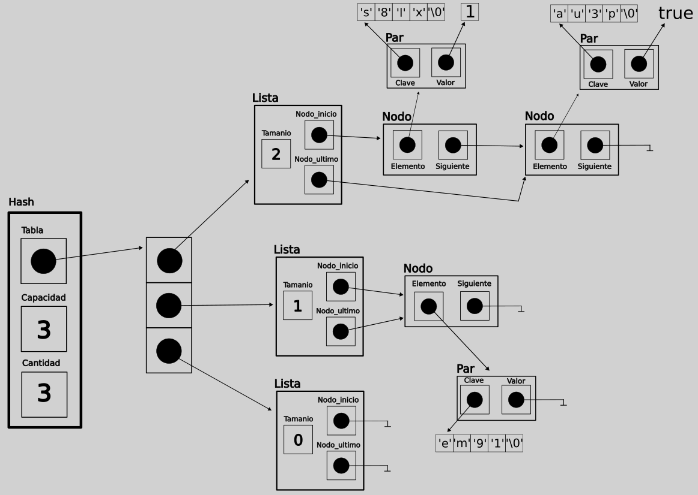

<div align="right">
</div>

# TDA HASH

- Para compilar:

```bash
gcc src/*.c pruebas.c -o pruebas
```

- Para ejecutar:

```bash
./pruebas
```

- Para ejecutar con valgrind:
```bash
valgrind ./pruebas
```
---
##  Implementación de la tabla

Decidí implementar la tabla hash utilizando __listas enlazadas__, por dos razones:
- La primera es que es más sencillo para implementar las pruebas, ya que tengo acceso más fácil a cada elemento de la lista. En cambio, si utilizaba un abb, que es el otro tda que tengo implementado, no podía ingresar con tanta facilidad ya que los elementos no están ordenados de manera lineal.
- Por otro lado, en cuanto a complejidades, el abb no es mucho más performante que la lista, ya que, aunque la búsqueda es O(log(n)) en el mejor caso, en el peor es O(n), al igual que la lista, porque a menos que se utilice por ejemplo un avl, puede terminar degenerándose en lista, y pierde la gracia de que sea un abb. Y aunque no se degenere y sea O(log(n)), como estamos en un hash, las listas que se formen en cada posición de la tabla no van a ser tan grandes como para suponer una diferencia muy notoria de complejidad. Esto aplica también para la eliminación.

    Además, la lista es mucho más rápida para la inserción, ya que al tener una referencia al último nodo, esta operación es __O(1)__, mientras que en un abb es __O(log(n))__ en el mejor caso y __O(n)__ en el peor. Esto hace también que el __rehash__ sea __O(nlog(n))__, ya que debemos ir recorriendo todo el abb y por cada elemento del mismo insertarlo en otro abb, es decir que realizamos n veces una operación de complejidad __log(n)__. En cambio, con listas, el __rehash__ es __O(n)__, porque por cada elemento del hash tenemos una operación de complejidad __O(1)__.

## Funcionamiento

### Estructura
Para mi implementación, utilicé un struct __hash__ con un vector __tabla__ de punteros a listas enlazadas, la __capacidad__ de esta tabla y la __cantidad__ de elementos del hash. Los elementos del hash son structs __par_clave_valor__, que justamente tienen un string __clave__, y un void pointer __valor__.

```c
struct hash {
	lista_t **tabla;
	size_t capacidad;
	size_t cantidad;
};

typedef struct par_clave_valor {
	char *clave;
	void *valor;
} par_cv_t;
```

<div align="center">

</div>

_Representación gráfica de un ejemplo de hash en memoria_

### Función hash

Para mi implementación de la __función hash__, simplemente decidí sumar los valores ascii de los caracteres de la clave para la función hash. De esta manera obtenía un entero que depende de los caracteres de la clave, por lo que dentro de todo la distribución en la tabla sería medianamente balanceada.

```c
int funcion_hash(const char *clave)
{
	int i = 0, suma = 0;
	while (i < strlen(clave)) {
		suma = suma + clave[i];
		i++;
	}
	return suma;
}
```

### Creación

Para crear un hash, simplemente reservé memoria para la estructura en __hash_crear__, y luego en la función __inicializar_tabla__ reservé tantos bloques de memoria como pedía la capacidad del hash con calloc, tras lo cual iteré por cada casillero de la tabla y en cada uno creé una lista vacía.

```c
hash_t *inicializar_tabla(hash_t *hash)
{
	hash->tabla = calloc(hash->capacidad, sizeof(lista_t *));
	if (!hash->tabla)
		return NULL;
	for (int i = 0; i < hash->capacidad; i++) {
		hash->tabla[i] = lista_crear();
	}
	return hash;
}
```

### Insertar

Para la inserción, hice que la función __hash_insertar__ llame a otra función (__insertar_sin_rehash__) que se encarga de insertar la clave y el valor en el hash, pero que no controla el factor de carga para el __rehash__. De esta manera, en el __rehash__ podía llamar a esta última función para insertar los elementos del hash original en el hash más grande, ya que estaba seguro de que en ese caso el __rehash__ justamente no sería necesario. 

__insertar_sin_rehash__ también recibía un booleano __hash_buscar_duplicado__, que servía para saber si debía recorrer la lista para actualizar un valor si había una clave duplicada. Esto me sirvió para reducir mínimamente la complejidad del __rehash__, ya que estaba seguro de que no iban a haber claves duplicadas.

En __hash_insertar__, antes de llamar a la función __insertar_sin_rehash__, hacía el control del factor de carga para hacer el rehash.

En __insertar_sin_rehash__, primero reservé memoria para el par clave-valor que iba a insertar. Luego reservé memoria para la copia de la clave pasada por parámetro, tras lo cual hice la copia. Por último guardé la clave y el valor en el par.

```c
...
	par_cv_t *par = malloc(sizeof(par_cv_t));
	if (!par)
		return NULL;
	char *clave_copia = malloc((strlen(clave) + 1));
	if (!clave_copia) {
		free(par);
		return NULL;
	}
	strcpy(clave_copia, clave);
	par->clave = clave_copia;
	par->valor = elemento;
...
```

Luego llamé a la función __actualizar_anterior__, que justamente se encargaba de reemplazar el valor de *anterior si este no era NULL. Lo que hice fue utilizar la función __lista_buscar_elemento__ pasando como parámetro la clave a insertar y una función __comparador_claves__ que se encargaba de comparar la clave de cada par de la lista con la clave "modelo". Si encontraba un par guardaba el valor del mismo en *anterior, y si no reemplazaba *anterior por NULL.

```c
void actualizar_anterior(hash_t *hash, void **anterior, const char *clave,
			 int posicion)
{
	if (anterior) {
		par_cv_t *par_anterior =
			lista_buscar_elemento(hash->tabla[posicion],
					      comparador_claves, (void *)clave);
		if (par_anterior)
			*anterior = par_anterior->valor;
		else
			*anterior = NULL;
	}
}
```
Luego de esto, volviendo a __insertar_sin_rehash__, llamaba a la función __lista_con_cada_elemento__ pasando por parámetro el par que había creado y una función que se encargaba de cambiar el valor del par de la lista cuya clave coincidía con la del par pasado por parámetro. De esta manera me encargaba de actualizar el valor si había una clave repetida. Si había una clave repetida devolvía false para frenar el recorrido de __lista_con_cada_elemento__. Esto, como dije antes, lo hacía si el parámetro __hash_buscar_duplicado__ era true.

```c
bool cambiar_valor_de_clave_repetida(void *par1, void *par2)
{
	const char *clave = ((par_cv_t *)par2)->clave;
	void *valor = ((par_cv_t *)par2)->valor;
	if (comparador_claves(par1, (void *)clave) == 0) {
		((par_cv_t *)par1)->valor = valor;
		return false;
	}
	return true;
}
```
Si __lista_con_cada_elemento__ me devolvía un size_t menor al tamaño de la lista, es porque se había actualizado un elemento, por lo que ya no debía seguir con la inserción y tampoco necesitaba la memoria reservada para el nuevo par y la copia de la clave.
```c
	if (pares_iterados < lista_tamanio(hash->tabla[posicion])) {
		free(clave_copia);
		free(par);
		return hash;
	}
```

Si no había una clave repetida, simplemente llamaba a lista_insertar pasando el par creado, para insertarlo en la lista de la tabla correspondiente a la posición asociada a la clave.

```c
	if (!lista_insertar(((hash_t *)hash)->tabla[posicion], par)) {
		free(clave_copia);
		free(par);
		return NULL;
	}
```

__hash_insertar__, sin contar el __rehash__, tiene una complejidad __O(n)__, siendo n el tamaño de la lista enlazada en la que se inserta el elemento. Es __O(n)__ porque debemos recorrer sus elementos para saber si hay algúna clave duplicada, ya que la inserción en si misma, al estar utilizando una lista enlazada, es __O(1)__. Obviamente este tamaño, si la función hash funciona bien, es menor al del hash, por lo que la inserción no es __O(n)__ respecto del tamaño de este último.

En cuanto al __rehash__, decidí crear un nuevo hash con el doble de capacidad del original y luego, utilizando __hash_con_cada_clave, el iterador interno__, fui insertando los pares del hash original en el nuevo. Por último, realicé un swap entre los dos hash y liberé el nuevo. El swap lo hice cambiando la referencia de la tabla y las capacidades, ya que, como no recibía un doble puntero al hash, no podía cambiar este puntero.

```c
void hash_swap_y_liberar_uno(hash_t *hash, hash_t *hash_a_quitar)
{
	lista_t **tabla_aux = hash->tabla;
	hash->tabla = hash_a_quitar->tabla;
	hash_a_quitar->tabla = tabla_aux;
	hash->capacidad = hash->capacidad * 2;
	hash_a_quitar->capacidad = hash_a_quitar->capacidad / 2;
	hash_destruir(hash_a_quitar);
}
```

Al tener un booleano en __insertar_sin_rehash__ que permite no tener que iterar la lista en la que se va a insertar para buscar duplicados, ya que en el rehash esto no es necesario, por cada elemento no debemos hacer una operación __O(n)__, siendo n la cantidad de elementos de la lista actual, sino que solo debemos insertar el elemento en la lista, lo que constituye una operación con complejidad __O(1)__. Es decir que insertar todos los elementos en el nuevo hash tiene complejidad __O(n)__, siendo n la cantidad de elementos del hash original. Luego, para eliminar el nuevo hash, de nuevo tenemos una operación __O(n)__. Por lo tanto, el __rehash__ tiene complejidad __O(n)__.

### Quitar

En __hash_quitar__, lo primero que hice fue recorrer la lista donde se encontraría la clave a eliminar con el iterador interno __lista_con_cada_elemento__, pasándole la función __encontrar_elemento_con_clave__ y la clave a quitar. 

```c
int posicion = funcion_hash(clave) % (int)((hash_t *)hash)->capacidad;
size_t posicion_a_quitar = lista_con_cada_elemento(
	hash->tabla[posicion], encontrar_elemento_con_clave,
	(void *)clave);
```

La función __encontrar_elemento_con_clave__ se encargaba de comparar cada clave con esta última, y devolvía false si eran iguales (reutilicé la función __comparador_claves__).

```c
bool encontrar_elemento_con_clave(void *par, void *clave)
{
	return (comparador_claves(par, clave) != 0);
}
```

Como __lista_con_cada_elemento__ devuelve la cantidad de elementos iterados, me guardé ese numero en la variable __posicion_a_quitar__, y con esa posición (si no era igual al tamaño de la lista, ya que si era igual es porque había iterado todos los elementos y ninguno tenía la clave a quitar, por lo que en ese caso devolvía NULL) llamé a la función __quitar_elemento__, que se encargaba de quitar el elemento de la lista con __lista_quitar_de_posicion__, liberar el par y la clave y devolver el elemento.

```c
void *hash_quitar(hash_t *hash, const char *clave)
{
	...
	if (posicion_a_quitar < lista_tamanio(hash->tabla[posicion])) {
		return quitar_elemento(hash, posicion_a_quitar, posicion);
	}
	return NULL;
}

void *quitar_elemento(hash_t *hash, size_t posicion_lista, int posicion_hash)
{
	par_cv_t *par_quitado = lista_quitar_de_posicion(
		hash->tabla[posicion_hash], posicion_lista);
	void *elemento_quitado = par_quitado->valor;
	free(par_quitado->clave);
	free(par_quitado);
	hash->cantidad--;
	return elemento_quitado;
}
```

En el peor caso, que sería que la clave esté al final de la lista, __hash_quitar__ tiene complejidad __O(n)__, siendo n la cantidad de elementos de la lista donde se encuentra la clave. 

### Obtener y hash_contiene

En __hash_obtener__ simplemente utilicé la función __lista_buscar_elemento__ pasando la lista donde se encontraría la clave, y __comparador_claves__ para ir comparando las claves de cada par con la que se quiere obtener. Si la clave estaba en la lista, devolvía su valor. Si no devolvía NULL.

```c
void *hash_obtener(hash_t *hash, const char *clave)
{
	if (!hash || !clave)
		return NULL;
	int posicion = funcion_hash(clave) % (int)((hash_t *)hash)->capacidad;
	par_cv_t *par_encontrado = lista_buscar_elemento(
		hash->tabla[posicion], comparador_claves, (void *)clave);
	if (par_encontrado)
		return par_encontrado->valor;
	return NULL;
}
```
La función __hash_contiene__ es básicamente igual, pero en vez de devolver el valor devolvía true si la clave estaba en la lista.

```c
bool hash_contiene(hash_t *hash, const char *clave)
{
	if (!hash || !clave)
		return false;
	int posicion = funcion_hash(clave) % (int)((hash_t *)hash)->capacidad;
	par_cv_t *par_encontrado = lista_buscar_elemento(
		hash->tabla[posicion], comparador_claves, (void *)clave);
	return par_encontrado != NULL;
}
```
En el peor caso, que sería que la clave esté al final de la lista o que no esté, ambas operaciones tienen complejidad __O(n)__, siendo n la cantidad de elementos donde estaría la clave, ya que deberíamos recorrer toda la lista para buscar la clave.

### Destruir 

Para __hash_destruir_todo__ creé el struct __destructor_aux__, que contiene la función destructora para invocar con cada valor. De esta manera, pude utilizar __hash_con_cada_clave__ pasándole la función __destruir_todo__ y el struct con la función destructora.

```c
typedef struct estructura_auxiliar_para_destructor {
	void (*destructor)(void *);
} destructor_t;

void hash_destruir_todo(hash_t *hash, void (*destructor)(void *))
{
	...
	destructor_t destructor_aux = { .destructor = destructor };
	hash_con_cada_clave(hash, destruir_todo, (void *)&destructor_aux);
	...
}
```
En la función __destruir_todo__ primero invoqué la función destructora (si no era NULL) con el valor de cada par iterado, y luego liberé la clave. Devolvía true para seguir iterando por el hash.

```c
bool destruir_todo(const char *clave, void *valor, void *destructor_aux)
{
	void (*destructor)(void *) =
		((destructor_t *)destructor_aux)->destructor;
	if (destructor) {
		destructor(valor);
	}
	free((void *)clave);
	return true;
}
```
Luego de esto, en __hash_destruir_todo__, iteré por todas las listas de la tabla llamando a lista_destruir_todo pasándole free, para liberar cada par clave-valor, cuyos elementos ya habían sido liberados en __destruir_todo__. Con la tabla vacía ya pude liberar primero la tabla y luego el hash.

```c
void hash_destruir_todo(hash_t *hash, void (*destructor)(void *))
{
	...
	for (int i = 0; i < hash->capacidad; i++) {
		lista_destruir_todo(hash->tabla[i], free);
	}
	free(hash->tabla);
	free(hash);
}
```

En __hash_destruir__ simplemente llamé a __hash_destruir_todo__ pasándole NULL como función destructora.

Ambas operaciones tienen complejidad __O(n)__, ya que debemos recorrer todos los elementos del hash para liberarlos.

### Iterador interno

Para __hash_con_cada_clave__ creé el struct __aux_iterador_t__, el cual contenía la función del iterador y el parámetro aux. Esto me permitió, iterando por cada lista de la tabla hash, llamar a __lista_con_cada_elemento__ pasándole como parámetro el struct y la función __llamar_funcion_con_clave_y_valor__. En esta última simplemente llamaba a la función pasada al iterador del hash con la clave y el valor del par actual del iterador de la lista, y el parámetro aux que estaba guardado en el struct, y devolvía su valor de retorno (un booleano).

```c
bool llamar_funcion_con_clave_y_valor(void *par, void *f_y_aux)
{
	void *aux = ((aux_iterador_t *)f_y_aux)->aux;
	bool (*f)(const char *, void *, void *) =
		((aux_iterador_t *)f_y_aux)->f;
	const char *clave = ((par_cv_t *)par)->clave;
	void *valor = ((par_cv_t *)par)->valor;
	return f(clave, valor, aux);
}
```

Mientras tanto, en __hash_con_cada_clave__, me iba guardando en una variable la cantidad de elementos iterados en cada lista y lo iba sumando a otra variable, que es la que devolvía el iterador del hash. Si la cantidad de pares iterados en la lista era menor a su tamaño, es porque la función había devuelto false. En este caso debía cortar toda la iteración del hash, y devolvía la cantidad de elementos iterados del hash.

```c
size_t hash_con_cada_clave(hash_t *hash,
			   bool (*f)(const char *clave, void *valor, void *aux),
			   void *aux)
{
	...
	for (int i = 0; i < hash->capacidad; i++) {
		pares_iterados = lista_con_cada_elemento(
			hash->tabla[i], llamar_funcion_con_clave_y_valor,
			(void *)&f_y_aux);
		resultado = resultado + pares_iterados;
		if (pares_iterados < lista_tamanio(hash->tabla[i])) {
			resultado++;
			return resultado;
		}
	}
	return resultado;
}
```
Obviamente, iterar todo el hash tiene complejidad __O(n)__, siendo n la cantidad de elementos del hash (a menos que se corte la iteración en el medio).